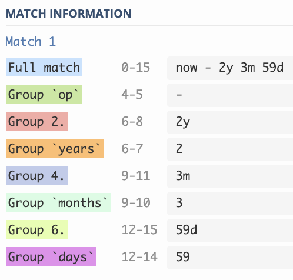

# My Regular Expressions

#### Check date from year 2000 (YYYY-MM-DD)

```bash
^20\d{2}-(?:0\d|1[0-2])-(?:3[01]|[12][0-9]|0[1-9])$
# ?: in groups for disable greedy checking
# full match
```

| Pass       | Fail       |
| ---------- | ---------- |
| 2000-12-30 | 1999-12-14 |
| 2010-09-02 | 2019-2-2   |
| 2019-12-13 | 2010-09-32 |

#### Date now +/- y m m

```bash
^now ?(-|\+) ?((\d+)y)? ?((\d+)m)? ?((\d+)d)?$
^now ?(-|\+) ?(([1-3])y)? ?(([1-9]|1[01])m)? ?(([1-9]|[1-9]\d)d)?$

# python style grouping "?P<group>"
^now ?(?P<op>-|\+) ?((?P<years>[1-3])y)? ?((?P<months>[1-9]|1[01])m)? ?((?P<days>[1-9]|[1-5]\d)d)?$

# group matching
```


